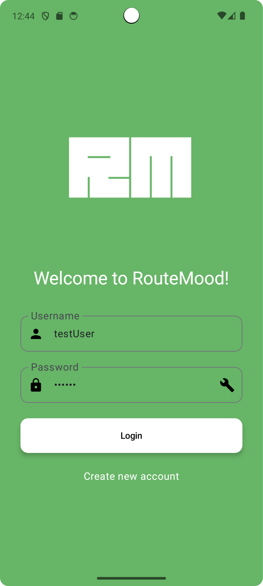
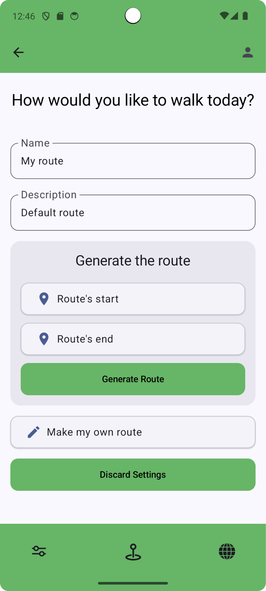
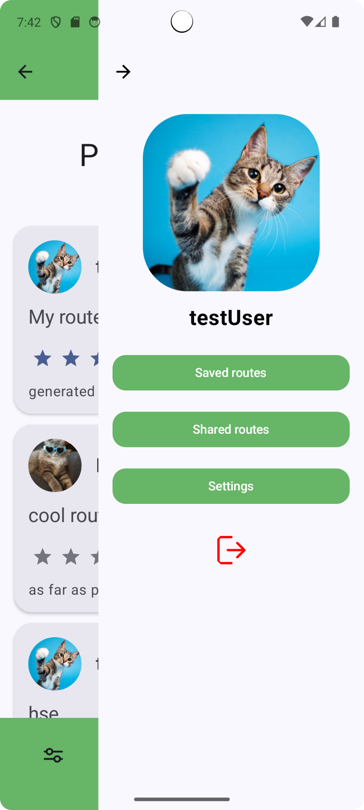
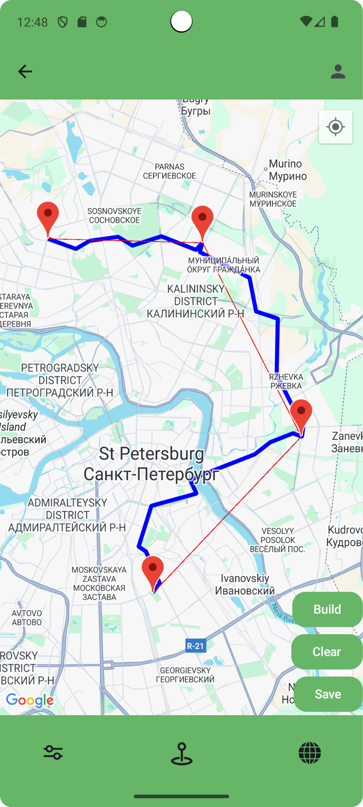
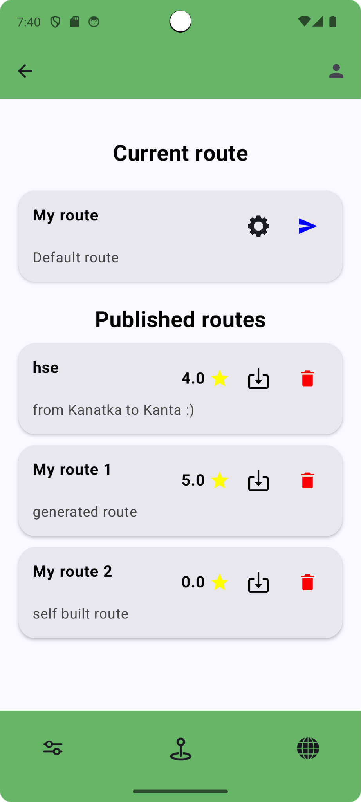
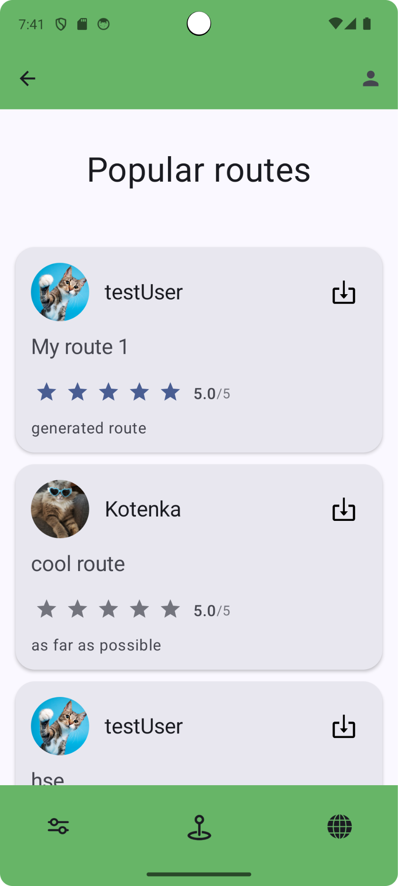

# RouteMood: Ваш личный гид по новым приключениям!

Устали от однообразных прогулок? Не можете решить, куда пойти? **RouteMood** здесь, чтобы превратить ваше настроение и желания в уникальные и захватывающие пешеходные маршруты! Наше интеллектуальное приложение использует возможности нейронных сетей для создания персонализированных путешествий специально для вас.

Если вам грустно и хочется поднять настроение, или вы ищете заряд вдохновения, просто скажите RouteMood, что у вас на уме. Мы подберем идеальный путь, соответствующий вашим чувствам.

## ✨ Ключевые особенности

*   **🧠 Генерация маршрутов с помощью ИИ**: Просто опишите свое настроение или смутное пожелание (например, «Хочу приключений» или «Покажи мне что-нибудь красивое»), и наш ИИ разработает для вас индивидуальный маршрут.
*   **🎨 Гибкая настройка**: Вы все контролируете! Настройте длину маршрута, примерное время и типы мест, которые вы хотите увидеть по пути — будь то уютные кафе, тихие парки или потрясающие городские достопримечательности.
*   **🗺️ Интерактивная карта**: Создавайте свои собственные приключения с нуля! Расставляйте маркеры прямо на карте, чтобы создать собственный маршрут, или легко редактируйте пути, предложенные нашим ИИ.
*   **❤️ Сообщество и обмен**:
    *   Сохраняйте любимые маршруты, чтобы пройти их снова позже.
    *   Делитесь своими творениями с сообществом RouteMood.
    *   Находите, проходите и оценивайте маршруты, созданные другими пользователями.
*   **👤 Персонализированный профиль**:
    * Настраивайте свой профиль и добавляйте аватарку, чтобы выделиться в сообществе. 
    * Отслеживайте сохранённые и опубликованные маршруты. 
    * Получайте оценки и отзывы о своих приключениях.

## 📸 Скриншоты

| Экран входа                            | Настройки маршрута | Профиль |
|----------------------------------------|-------------------|---------|
|  |  |  |

| Создание маршрута | Опубликованные маршруты | Рейтинг |
|-------------------|------------------|---------|
|  |  |  |

## 🎥 Демонстрационное видео

Посмотрите наше демонстрационное видео, чтобы увидеть RouteMood в действии!

[Смотреть демо-видео на Google Drive](https://drive.google.com/file/d/1_jxvSYcs2kfD4a__Ad7D6kxh-vKD-Jcc/view?resourcekey)

---

**Скачайте RouteMood сегодня и откройте для себя свой город заново!** 

---

## 📺 Для рекламодателей

**RouteMood** предлагает возможность демонстрации кратких видеороликов (до 15 секунд) во время генерации маршрута пользователю. Это мягкая и ненавязчивая интеграция рекламы, которая не мешает пользовательскому опыту и при этом эффективно привлекает внимание аудитории.

Свяжитесь с нашей командой, чтобы обсудить рекламное размещение!
